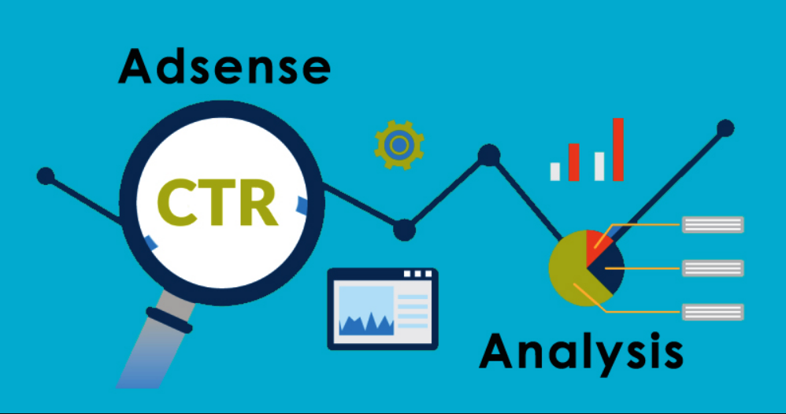

# Click-Through Rate (CTR) Prediction for Online Advertising
## Overview
Most websites include ads, and the online advertising industry, dominated by players like Google, Amazon, and Facebook, relies heavily on data-driven decisions. A crucial exercise for marketing companies is predicting the click-through rate (CTR) to determine which ad to use, whom to target, where to place ads, and on which devices. This project aims to predict whether a user will click on an ad, using classification methods.

## Data Description
### Dataset: 
The dataset contains 99,999 rows and 27 columns. You can download it from this link.
### Objective: 
Predict if a user will click on an ad.
### Classification Methods: 
Apply any 3 classification methods taught in Course 3 – The introduction to Machine Learning.

## Project Steps
### 1. Data Understanding:

Check for imbalance (e.g., 87% 'False', 13% 'True' labels).
Handle missing values and outliers if necessary.

### 2. Categorical Variable Treatment:

Identify and encode categorical columns properly (e.g., one-hot encoding for banner position).

### 3. Data Split:

Split the dataset into training and testing sets (e.g., 70-30 or 80-20).

### 4. Model Selection:

Choose 3 classification methods.
Justify the selection based on the business scenario and model interpretability needs.

### 5. Model Evaluation:

Use evaluation metrics like accuracy, precision, recall, and AUC-ROC.
Compare the performance of the 3 models.

### 6. Model Improvement:

Use cross-validation and feature selection to enhance predictability.

### 7. Model Risks and Presentation:

Discuss risks associated with adopting the best model.
Create a 3-5 slide presentation to explain the model evaluation and risks to the business team.

## Conclusion
This project provides a comprehensive approach to CTR prediction for online advertising, focusing on data preparation, model selection, evaluation, and risk assessment. By following these steps, marketing companies can make informed decisions about ad placement and audience targeting.
